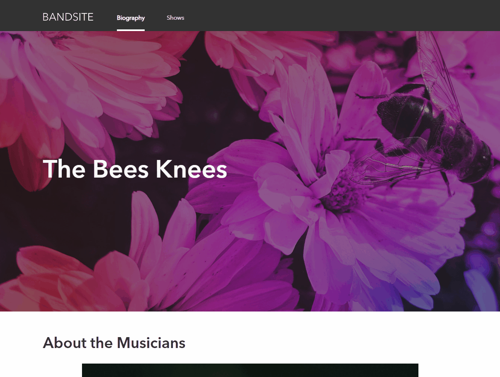
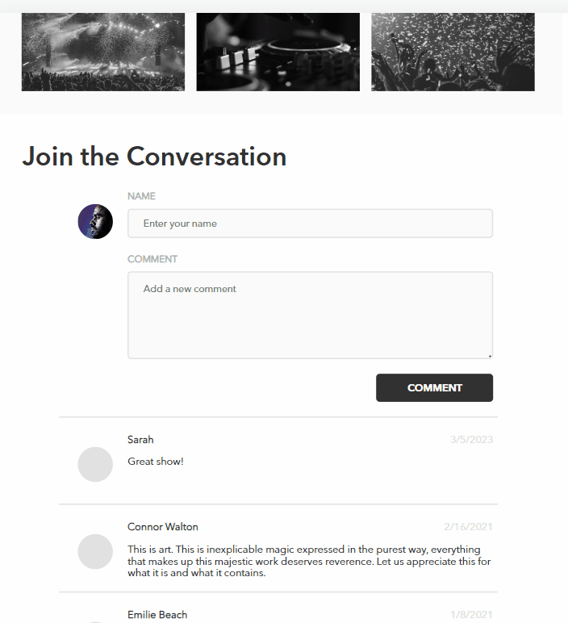

# Band Site (Bootcamp Project)

## JavaScript DOM, Web API, Responsive Design

Bootcamp project to build a website for a band, pulling data from a web api.

> ### Features
>
> - Embedded Soundcloud music player
> - Adding comments via POST request
> - Fully responsive design with interactive styling

<br>

### Biography Page


<br>

### Shows Page



<br>

### POST comments to API


<br>

### Responsive design


<br><br>

### Functional Requirements

- The Bio Page must retrieve comment data from the provided API and display it on the page.
- Users must be able to add new comments that are stored on the back-end using the API.
- New comments that are added must be displayed with the existing comments, the newest comments being at the top.
- The Bio Page must not reload when comments are added.
- New comments are not required to have a provided avatar image, but can use a placeholder.
- The Shows Page must display the shows data retrieved from the API.

<br>

### Implementation Requirements

- The project's CSS must be derived from Sass and use any Sass features that make the code more concise and reusable, such as variables or mixins.
- The CSS classes must use BEM principles.
- The site must use Flexbox for layout control.
- The site must use axios (imported using a CDN) for the API HTTP requests.
- You must use addEventListener to register your event handler functions, instead of using HTML

<br><br>

## Setup

1. Clone this repository.
2. In the terminal, run the following command to install dependencies

```sh
npm i
```

3. Run the app on your local server
